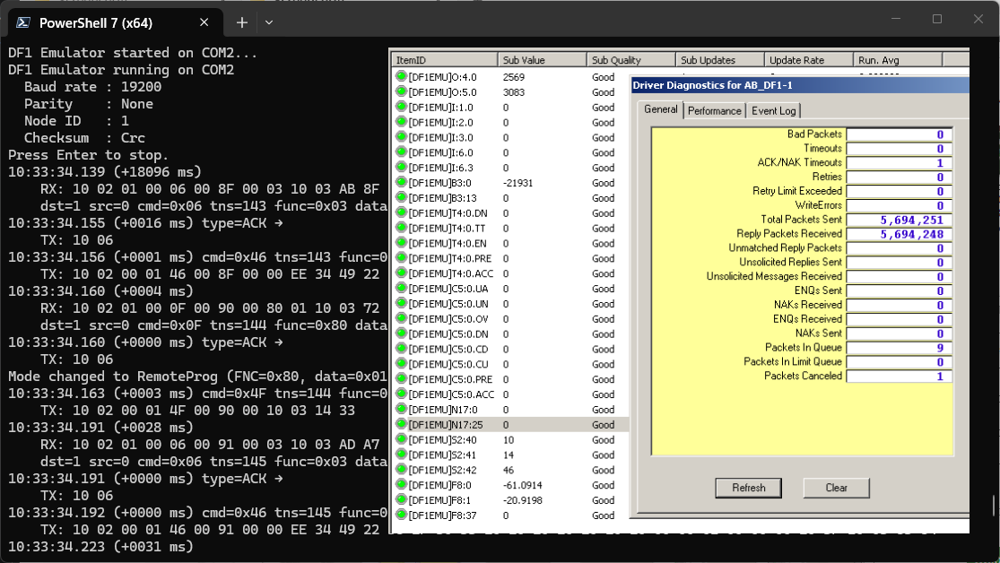

# DF1 SLC 5/03 Emulator

**Purpose**  
Lightweight, standalone DF1 RS-232 emulator that mimics an SLC 5/03 PLC for testing DF1 clients and RSLinx. This emulator does **not** depend on any external DF1 library – all DF1 framing, checksum (BCC/CRC), DLE stuffing, and memory simulation are self‑contained.

## Features
- DF1 full‑duplex framing with DLE STX / DLE ETX and DLE stuffing
- CRC‑16 (calculation as per AB specification) **default** – BCC (XOR) also supported
- Get Status response crafted for SLC 5/03 (processor code `0x49`)
- Reads from File 0 (directory) and any data file listed in the directory
- In‑memory PLC file store with pre‑defined files (O, I, S, B, N, F, T, C, R)
- Configurable serial settings via command line
- Console logging of RX/TX hex for debugging
- Independent – no external dependencies except `System.IO.Ports`

## Requirements
- .NET 8 SDK or later
- Virtual serial pair tool for testing (e.g., com0com on Windows)
- RSLinx Classic (optional, for integration testing)

## Build
```bash
dotnet build -c Release DF1Emulator.csproj
```

## Run

**Default** (COM2, 19200, no parity, node 1, CRC checksum):
```bash
dotnet run --project DF1Emulator.csproj -- COM2
```

**Examples:**
```bash
# Use BCC checksum, node 2
dotnet run --project DF1Emulator.csproj -- COM2 --checksum bcc --node 2

# Change baud rate and parity
dotnet run --project DF1Emulator.csproj -- COM3 --baud 9600 --parity even
```

### Command line options
| Option | Description | Default |
|--------|-------------|---------|
| `[port]` | Serial port name | `COM2` |
| `--baud <n>` | Baud rate | `19200` |
| `--parity <none/odd/even>` | Parity mode | `none` |
| `--node <n>` | Emulator node ID | `1` |
| `--checksum <crc/bcc>` | Checksum mode | `crc` |
| `--help, -h` | Show usage | – |

## Linux-specific notes

### Serial port naming
On Linux, serial ports are typically named `/dev/ttyS0`, `/dev/ttyUSB0`, `/dev/ttyACM0`, etc.  
The emulator accepts both formats: with or without the `/dev/` prefix.

```bash
# Both work:
dotnet run --project DF1Emulator.csproj -- ttyUSB0
dotnet run --project DF1Emulator.csproj -- /dev/ttyUSB0
```

### Virtual serial pair on Linux
To test the emulator without physical hardware, create a virtual pair using `socat`:

```bash
socat -d -d pty,raw,echo=0,link=/dev/ttyV0 pty,raw,echo=0,link=/dev/ttyV1
```

Then run the emulator on one end and your DF1 client on the other:

```bash
# Terminal 1 – emulator
dotnet run --project DF1Emulator.csproj -- ttyV0

# Terminal 2 – client (e.g., DF1Comm example or RSLinx) connected to ttyV1
```

### Permissions
Ensure your user has read/write access to the serial device. Add yourself to the `dialout` group if needed:

```bash
sudo usermod -a -G dialout $USER
# Log out and back in for changes to take effect
```

## Quick test with virtual serial pair

### Windows (using com0com)
1. Create a virtual COM pair (e.g., `COM1` ↔ `COM2`).
2. Start the emulator on `COM2`:
   ```bash
   dotnet run --project DF1Emulator.csproj -- COM2
   ```
3. Start your DF1 client on `COM1`.

### Linux (using socat)
1. Create a virtual pair:
   ```bash
   socat -d -d pty,raw,echo=0,link=/dev/ttyV0 pty,raw,echo=0,link=/dev/ttyV1
   ```
2. Start the emulator on `ttyV0`:
   ```bash
   dotnet run --project DF1Emulator.csproj -- ttyV0
   ```
3. Connect your DF1 client to `ttyV1`.

## RSLinx integration
- Create an **RS-232 DF1** driver in RSLinx.
- Point it to the COM port paired with the emulator.
- Use **19200 baud, No parity, 8 data bits, 1 stop bit** (or match the emulator settings).
- If RSLinx does not show the processor or memory, check the emulator console for hex logs and ensure `PlcMemory` file offsets match RSLinx expectations.



*RSLinx OPC Server accessing DF1Emulator memory in the background*

## Emulated SLC 5/03 Memory Layout

The emulator simulates a specific SLC 5/03 configuration with the following data files and program files.

### Data Files

**Total Files:** 32 | **Active Files:** 21 | **Total Memory (Words):** 714

| File | Type | Elem | WORDS | Last     |
|------|------|------|-------|----------|
| 0    | O    | 2    | 6     | O:1      |
| 1    | I    | 7    | 21    | I:6      |
| 2    | S    | 83   | 0     | S:82     |
| 3    | B    | 14   | 14    | B3:13    |
| 4    | T    | 78   | 234   | T4:77    |
| 5    | C    | 1    | 3     | C5:0     |
| 6    | R    | 2    | 6     | R6:1     |
| 7    | N    | 74   | 74    | N7:73    |
| 8    | F    | 38   | 76    | F8:37    |
| 9    | B    | 10   | 10    | B9:9     |
| 10   | B    | 71   | 71    | B10:70   |
| 11   | B    | 9    | 9     | B11:8    |
| 12   | B    | 1    | 1     | B12:0    |
| 13   | B    | 2    | 2     | B13:1    |
| 14   | B    | 1    | 1     | B14:0    |
| 15   | B    | 41   | 41    | B15:40   |
| 16   | B    | 41   | 41    | B16:40   |
| 17   | N    | 26   | 26    | N17:25   |
| 29   | B    | 26   | 26    | B29:25   |
| 30   | B    | 26   | 26    | B30:25   |
| 31   | B    | 26   | 26    | B31:25   |

### Program Files

**Total Files:** 24 | **Active Files:** 10

| Name                         | File | Type | Rungs |
|------------------------------|------|------|-------|
| SYSTEM DATA STORAGE HEADER   | 0    | SYS  | 0     |
| RESERVED FOR FUTURE USE      | 1    | SYS  | 0     |
| (no name)                    | 2    | LAD  | 23    |
| (no name)                    | 3    | LAD  | 13    |
| (no name)                    | 5    | LAD  | 24    |
| (no name)                    | 8    | LAD  | 26    |
| (no name)                    | 12   | LAD  | 16    |
| (no name)                    | 15   | LAD  | 22    |
| (no name)                    | 18   | LAD  | 18    |
| (no name)                    | 19   | LAD  | 6     |
| (no name)                    | 22   | LAD  | 14    |
| (no name)                    | 23   | LAD  | 9     |

### I/O Configuration

| Slot | Module      | Type           | Description                     |
|------|-------------|----------------|---------------------------------|
| 0    | 1747-L532E  | CPU            |                                 |
| 1    | 1746-IB16   | Digital Input  | 16 inputs, 2 bytes              |
| 2    | 1746-IB16   | Digital Input  | 16 inputs, 2 bytes              |
| 3    | 1746-IB16   | Digital Input  | 16 inputs, 2 bytes              |
| 4    | 1746-OB16   | Digital Output | 16 outputs, 2 bytes             |
| 5    | 1746-OB16   | Digital Output | 16 outputs, 2 bytes             |
| 6    | 1746-NI4    | Analog Input   | 4 channels × 2 bytes = 8 bytes  |

## Project structure
| File | Description |
|------|-------------|
| `Program.cs` | CLI entry point, argument parsing, usage help |
| `DF1Emulator.cs` | Core DF1 frame parsing, command handlers, ACK/NAK, serial I/O |
| `MessageDecoder.cs` | DLE stuffing/unstuffing, BCC/CRC checksum calculation |
| `PlcMemory.cs` | In‑memory file directory (File 0) and data files (O0, I1, S2, B3, N7, F8, T4, C5, R6, etc.) |

## Extending the emulator
- **Add new DF1 commands** – extend the dispatch logic in `DF1Emulator.ProcessFrame()`.
- **Add new data files** – modify `PlcMemory` constructor and the file directory inside `File 0`.
- **Change element sizes** – update `_bytesPerElement` dictionary and file size arrays.
- **Simulate timers/counters** – implement background thread that updates T4 and C5 structures.

## Troubleshooting
| Issue | Likely solution |
|-------|------------------|
| **Port busy / access denied** | Ensure no other application (including RSLinx) is using the same COM port. Use a virtual pair so emulator and client use different ends. |
| **Checksum mismatch** | Verify the client and emulator use the same checksum type (`--checksum crc` or `bcc`). Emulator defaults to **CRC**. |
| **RSLinx cannot see memory** | Enable verbose logging in emulator. Confirm that `Read File 0` requests are received and that the emulator responds with a valid directory. Check file offsets in `PlcMemory`. |
| **No response after ENQ** | Make sure the emulator is running on the correct COM port and the baud rate/parity matches the client. The emulator automatically replies with ACK to ENQ. |

## License
Same as the DF1Comm library.

## Contributing
- Fork, create a feature branch, and open a pull request.
- Keep the code **self‑contained** (no external DF1 library dependencies).
- Add unit tests for new features (mock `SerialPort` if needed).'
