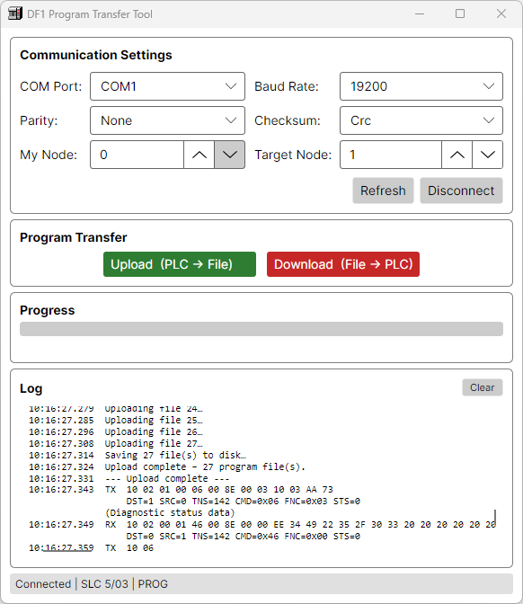

# DF1ProgramTool – Desktop GUI for PLC Upload/Download

**Purpose**  
Cross‑platform desktop GUI (Avalonia UI) that uploads the complete program from an Allen‑Bradley SLC or MicroLogix PLC to a binary file, and restores it back to a compatible controller. Designed as a lightweight, stand‑alone alternative for program backup and restore without RSLogix.

> **⚠️ CAUTION – REAL PLC HAZARD**  
> This tool performs **download** which overwrites the entire PLC program, including ladder logic and data tables.  
> Running download on a **real PLC** will **erase the existing program** and replace it with the contents of the selected file.  
> This may cause unexpected machine motion, loss of safety functions, or production downtime.  
> **Only use this tool on a real PLC if you fully understand the consequences and have a verified backup.**  
> For safe testing, use the [DF1Emulator](../DF1Emulator) first.

## Features
- Automatic **PLC detection** – processor type, family, and run/program mode.
- **Upload** – reads all program and data files, saves to a compact binary file (`.bin`) with a descriptive name.
- **Download** – restores a previously uploaded program to the same PLC family.
- **Supports** SLC 5/01, 5/02, 5/03, 5/04, 5/05 and MicroLogix 1000/1500.
- **Graphical COM port selection** – baud rate, parity, and node address configurable.
- **Progress indication** – shows current file being transferred.
- **Self‑contained** – uses only the DF1Comm library, no external UI dependencies.
- **⚠️ Download overwrites PLC memory** – use with extreme caution on real hardware

## Screenshots



*Main window after uploading DF1Emulator internal memory*

## Requirements
- .NET 8 SDK or later
- Windows / Linux / macOS (serial port support required)
- For testing without hardware: virtual serial pair + DF1Emulator (included in the same repository)

## Build
From the repository root:
```bash
dotnet build src/DF1ProgramTool/DF1ProgramTool.csproj
```

Or build the whole solution:
```bash
dotnet build DF1Comm.sln
```

## Run
```bash
dotnet run --project src/DF1ProgramTool
```

**Command line options** – none (all settings are configured in the GUI).

## Linux-specific notes

### Permissions
Ensure your user has read/write access to the serial device. Add yourself to the `dialout` group if needed:
```bash
sudo usermod -a -G dialout $USER
# Log out and back in for changes to take effect
```

### No serial ports detected

On some Linux systems, `SerialPort.GetPortNames()` may return an empty list even when devices are present.  
DF1ProgramTool detects this and provides a fallback list of typical device names:

- `/dev/ttyS0`   – legacy serial port
- `/dev/ttyUSB0` – USB‑to‑serial adapter (most common)
- `/dev/ttyACM0` – Arduino / modem style devices
- `/dev/ttyS31`  – a high‑numbered port intended for symbolic links

If your device uses a different name (e.g. `/dev/ttyUSB1`), you can create a symlink to one of the listed names:

```bash
sudo ln -s /dev/ttyUSB1 /dev/ttyS31
```

Then select `/dev/ttyS31` from the port list in the GUI.

## Testing with the DF1Emulator

1. Create a virtual serial pair (e.g. `COM1` ↔ `COM2` on Windows, or `ttyV0` ↔ `ttyV1` using `socat` on Linux).
2. Start the emulator on one end:
   ```bash
   dotnet run --project src/DF1Emulator -- COM2 --checksum crc
   ```
3. Start DF1ProgramTool and connect to the **other** end (`COM1` or `ttyV1`).
4. Upload, then download – the emulator behaves like a real SLC 5/03.

## File format

The generated `.bin` file contains a raw DF1 memory snapshot with a comprehensive header and integrity checks:

| Offset | Content                                       |
|--------|-----------------------------------------------|
| 0      | Magic number `0xDF1A`                         |
| 2      | Version (current `1`)                         |
| 3      | Processor type (int32)                        |
| 7      | Series/revision (byte)                        |
| 8      | RAM size in KB (byte)                         |
| 9      | Family tag (8 bytes, ASCII, e.g. "SLC    ")   |
| 17     | Bulletin length (int32)                       |
| 21     | Bulletin string (UTF‑8, e.g. "5/03")          |
| 21+len | Timestamp (int64, UTC binary)                 |
| 29+len | Number of files (int32)                       |
| 33+len | For each file:                                |
|        | - File number (int32)                         |
|        | - File type (int32)                           |
|        | - Number of bytes (int32)                     |
|        | - Data length (int32)                         |
|        | - Raw data                                    |
| End    | CRC32 (uint32) of all preceding data          |
| End+4  | SHA256 (32 bytes) of all preceding data       |

This format is **not compatible** with `.RSS` files from RSLogix; it is intended only for exchange between DF1Comm‑based tools.  
The file includes both CRC32 and SHA256 checksums to detect accidental corruption and intentional tampering.  
During download, the tool validates the processor type and bulletin against the target PLC to prevent mismatched downloads.

## Troubleshooting

| Issue | Likely solution |
|-------|------------------|
| **Not connected** after click | Check cable, baud rate, parity, and target node ID. Ensure the PLC is in REM position (for SLC 5/03/04). |
| **Upload/Download buttons disabled** | PLC type is not supported (e.g. PLC‑5) or identification failed. |
| **Invalid Address** during download | The selected binary file does not match the target PLC memory layout (different processor family). |
| **Dialog hangs / no reaction** | Run from a terminal to see debug output; ensure the main window is not hidden. |
| **PLC stopped working after download** | You downloaded a program file that is not compatible with your PLC. Restore the original backup using RSLogix or this tool if a correct backup exists. |

## Project structure
| File | Description |
|------|-------------|
| `Program.cs` | Application entry point |
| `App.axaml` / `App.axaml.cs` | Avalonia application setup |
| `Views/MainWindow.axaml` | Main window XAML layout |
| `ViewModels/MainWindowViewModel.cs` | MVVM logic for communication and transfer |
| `Models/PlcInfo.cs` | PLC type information |
| `Services/FrameDecoder.cs` | DF1 serial frame decoder for logging |
| `Services/PlcIdentifier.cs` | Processor type detection |
| `Services/ProgramTransferService.cs` | Upload/download and file serialisation |
| `Utilities/Crs32.cs` | Small CRC32 helper (IEEE 802.3 polynomial 0xEDB88320) |

## License
Same as the DF1Comm library (GPLv3+).

## Contributing
- Fork, create a feature branch, and open a pull request.
- Test with both the DF1Emulator and real hardware when possible.
